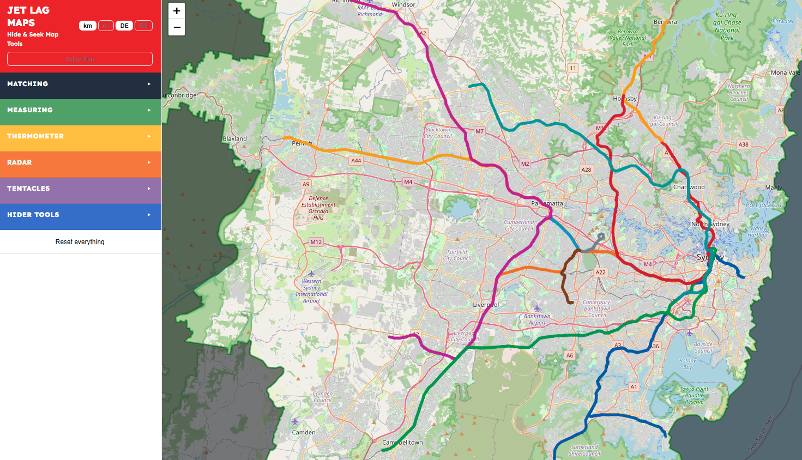

# Interactive tools for Jet Lag – Hide & Seek

> A fork of Cniehaus's Jet Lag Maps - reworked ui and user flow, cleaning up user experience.

> An interactive map tool for the game [Jet Lag: The Game – Hide & Seek](https://store.nebula.tv/collections/jetlag/products/hideandseek).
> Plan your game with live OpenStreetMap data: city boundaries, postal codes, hospitals, train stations, bus lines, and much more – fully printable as A4 PDF.

**[▶ Open the live app](https://patokyo.github.io/jetlagtools-hideandseek/)**



---

# Features

## Map Setup and planning

Use setup map mode to plan the game area, decide allowed transit routes (train/tram lines, bus routes) and prepare and cache POI layers!
Once setup, the map can be exported to a JSON file that can be used to load the map without making unnecessary API calls!

## Seeker tools

Tools that the group of seekers can use to narrow down where the hiders are.

### Matching

Choose a cached POI layer and a location - If the hider shares the same closest POI in that layer, or is closer to a different POI, automatically blocks out sections of the map the hider cannot be.

### Measuring

Choose a cached POI layer and a location - Depending on whether the hider is closer to or further from a POI in that layer than the seekers, blocks out sections of the map they cannot be in.

### Thermometer

Choose a location on the map, then use the guide circle to choose a second point exactly X distance away. After travelling X distance, depending on whether you are now closer to or further from the hider,
blocks out the section of the map they cannot be.

### Radar

Choose a location and a radius, depending on whether the hider is in that zone, blocks out sections of the map they cannot be.

### Tentacles

Choose a location and a cached POI layer, then choose which POI the hider is closest to within that radius. Blocks out sections of the map the hider cannot be.

## Hider tools

### Hiding zone

Creates radius around station the hider chooses.

### Check nearest POI

Helpful for answering matching and measuring questions. Choose a cached POI layer and your location and displays the closest POI of that layer and how far away it is.

---

## Tech Stack

| What             | Library / API                                                       |
| ---------------- | ------------------------------------------------------------------- |
| Map rendering    | [Leaflet 1.9](https://leafletjs.com/)                               |
| Map tiles        | OpenStreetMap, CARTO, Esri, memomaps                                |
| POI & route data | [Overpass API](https://overpass-api.de/) (with 3-endpoint fallback) |
| Geocoding        | [Nominatim](https://nominatim.openstreetmap.org/)                   |
| OSM → GeoJSON    | [osmtogeojson](https://github.com/tyrasd/osmtogeojson)              |
| Spatial analysis | [Turf.js 6](https://turfjs.org/) (Voronoi + geodesic projection)    |
| Languages        | Plain JS objects (`langs/de.js`, `langs/en.js`)                     |

No build step, no bundler, no framework. Just HTML + CSS + vanilla JS.

---

## Project Structure

```text
hideandseek-map/
├── index.html          # Shell: HTML layout + <script> load order
├── style.css           # All styles (sidebar, map, print)
│
├── langs/
│   ├── de.js           # German translations (LANG_DE object)
│   └── en.js           # English translations (LANG_EN object)
│
└── js/
    ├── config.js       # Constants: tile URLs, COLOR_THEMES (default + colorblind), Overpass endpoints
    ├── i18n.js         # t(), tf(), switchLang(), applyI18n()
    ├── map.js          # Leaflet map init + setTileLayer()
    ├── overpass.js     # overpassFetch() – POST with endpoint fallback
    ├── renderers.js    # renderPLZ(), renderPOIs(), renderWater(), renderCityBoundary()
    ├── layers.js       # LAYER_DEFS (all POI filters) + layer management + recolorActiveLayers()
    ├── city.js         # searchCity() + km/mi unit helpers (stores OSM relation ID)
    ├── busroutes.js    # Bus/tram route line tool
    ├── radius.js       # Radius / interval circle tool (draggable)
    ├── measure.js      # Distance & bearing tool + map click handler (draggable)
    ├── boundarylayers.js # nominatimBoundaryLayer() – fetch + draw OSM boundary polygons
    ├── admin.js        # Administrative division checker (reverse-geocode + level comparison)
    ├── tentacles.js    # Tentacle / Voronoi question tool
    ├── permalink.js    # Shareable URL state
    └── ui.js           # Sidebar, print, error popup, style FAB, setColorMode()
```

The most important file for contributors is **`js/layers.js`** – it contains the complete definition of every map layer (Overpass query + colour + icon + renderer reference) in one place.

Colour definitions live in **`js/config.js`** inside `COLOR_THEMES`. Both `default` and `colorblind` objects follow the same structure (`plz`, `interval`, `busRoute`, and `layers` sub-keys), so adding a third theme is straightforward.

---

## Local use, how to run the software on your computer

No install needed.

```bash
git clone https://github.com/cniehaus/hideandseek-map.git
cd hideandseek-map
```

**Do not open `index.html` directly** (e.g. by double-clicking it). When a page is loaded via `file://`, browsers send requests with `Origin: null`, and external APIs like Nominatim and the Overpass API will reject them — so no data will load.

The easiest way is the bundled dev server (no install required on macOS/Linux):

```bash
python3 runserver.py
# → serves http://localhost:5500 and opens it in your browser
# picks the next free port automatically if 5500 is busy
```

`npm start` does the same. Any other static file server works too:

```bash
python3 -m http.server 8080   # → open http://localhost:8080
npx serve .                   # Node.js
```

---

## Contributing

Contributions are very welcome! Here are the most impactful areas.

### Good first issues

- **New map style** – add a tile provider to `TILE_LAYERS` in `js/config.js` and a button to the style popover in `index.html`
- **Additional languages** – create `langs/xx.js` following the same structure as `de.js`, add the detection logic in `index.html` (`<head>`)
- **Improved Overpass queries** – the existing queries are functional but not exhaustive; PRs that improve recall or reduce noise are welcome
- **Mobile UX** – layout and touch behaviour on small screens can always improve
- **Accessibility** – ARIA labels, keyboard navigation, colour-contrast improvements

### Sending a Pull Request

1. Fork the repository
2. Create a feature branch: `git checkout -b feature/my-new-layer`
3. Make your changes – no build step required
4. Open a Pull Request against `main` and describe what you changed and why

Please keep PRs focused: one feature per PR makes review much faster.

---

## Translation Guide

All user-visible strings live in `langs/de.js` (`LANG_DE`) and `langs/en.js` (`LANG_EN`). The keys are identical in both files.

```js
// langs/en.js
lyr_my_layer: 'My Layer Name',

// langs/de.js
lyr_my_layer: 'Mein Layer-Name',
```

Strings with placeholders use `{0}`, `{1}`, … and are called with `tf('key', value0, value1)`.

---

## Data & Privacy

- All geodata comes from [OpenStreetMap](https://www.openstreetmap.org/) (© OpenStreetMap contributors, ODbL).
- Geocoding requests go to the Nominatim service operated by the OSM Foundation.
- No user data is stored or transmitted to any server operated by this project.

---

## License

[GNU General Public License v3.0](LICENSE) – free to use, modify, and redistribute under the same licence.
